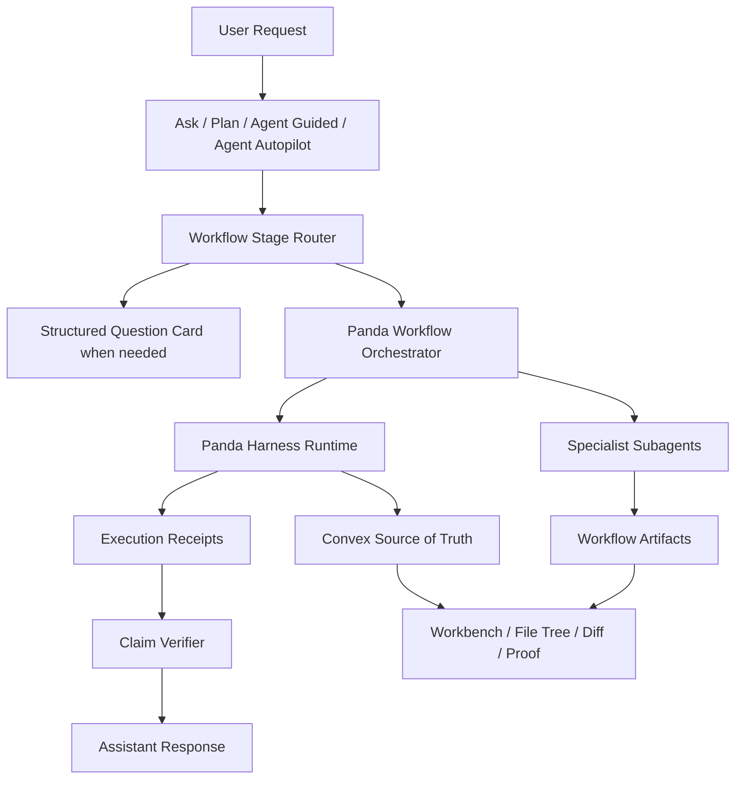

# Panda rpiv-mono-Inspired Workflow Orchestration Implementation Plan

> **Date:** 2026-05-24  
> **Status:** Proposed implementation plan  
> **Scope:** Panda-native adoption of the strongest `juicesharp/rpiv-mono` workflow patterns without replacing Panda's browser-first harness runtime.  
> **Primary goal:** Improve Panda's reliability, driver-in-the-loop workflow quality, artifact discipline, Subagents v2 usefulness, and file/workbench proof chain.

## Summary

Panda should adopt selected architectural patterns from `rpiv-mono` / `rpiv-pi`, but **must not embed `rpiv-pi` as a second runtime**. Panda already has the stronger product substrate for this direction: a browser-first workbench, Convex-backed state, mode-aware chat, file tree, diff review, execution receipts, checkpoints, admin policy, and an evolving Subagents v2 architecture.

The implementation should therefore build a **Panda-native Workflow Orchestration Layer** that borrows these `rpiv-mono` ideas:

1. artifact-based workflow progression,
2. structured user-question cards,
3. named specialist subagents,
4. advisor/reviewer checkpoints,
5. claim verification against real workspace state,
6. fresh/fork context discipline,
7. validation/review artifacts before final success claims.

The first milestone should focus on reliability rather than multi-agent spectacle: Panda should not allow an assistant message to claim files, folders, commands, or tests succeeded unless Panda has a durable receipt and can verify the workbench/file-tree state reflects it.

## Architecture



Core rule:

```text
Panda Harness Runtime + Convex Control Plane remains the only execution authority.
```

`rpiv-mono` should be treated as an architectural reference, not a runtime dependency.

## Product Mapping

| `rpiv-mono` concept | Panda-native equivalent | Implementation direction |
|---|---|---|
| `/skill:discover` | Ask/Plan clarification | Structured question cards and requirements artifact |
| `/skill:research` | Ask/Plan codebase research | Read-only specialist subagents and research artifact |
| `/skill:explore` | Plan alternatives | Solution comparison artifact |
| `/skill:design` | Plan architecture | Design section/artifact inside workbench plan |
| `/skill:plan` / `blueprint` | Panda implementation plan | Existing Plan mode plus staged plan metadata |
| `/skill:implement` | Agent Guided / Autopilot | Harness-driven tool calls with receipts |
| `/skill:validate` | Proof / execution receipts | Validation artifact linked to commands/tests |
| `/skill:code-review` | Review Diff / advisor pass | Diff auditor and advisor checkpoint |
| `.rpiv/artifacts/*` | Convex-backed artifacts | Optional workspace materialization later |
| Pi agent profiles | Panda built-in/custom subagents | Dynamic registry with capability presets |

## Implementation Plan

| Phase | Area | Planned direction | Priority |
|---:|---|---|---|
| 1 | Reliability foundation | Add strict proof chain for file/folder/command/test claims. | Critical |
| 2 | Structured user questions | Add Panda-native questionnaire cards inspired by `rpiv-ask-user-question`. | High |
| 3 | Workflow stages | Add formal workflow stage metadata under existing Ask/Plan/Agent modes. | High |
| 4 | Artifact pipeline | Persist requirements/research/design/plan/validation/review artifacts in Convex. | High |
| 5 | Specialist subagents | Add a small built-in set: locator, pattern finder, integration scanner, claim verifier, diff auditor, advisor reviewer. | High |
| 6 | Advisor gates | Add policy-based review checkpoints for risky work and Autopilot transitions. | Medium-High |
| 7 | Saved workflows/chains | Add reusable workflow chains only after receipts/artifacts/subagents are stable. | Medium |
| 8 | Optional workspace materialization | Optionally write `.panda/artifacts/*` files from Convex artifacts. | Low-Medium |

## Phase 1 — Reliability Foundation

### Objective

Ensure Panda cannot falsely claim that a folder/file was created, a command ran, or tests passed unless the claim is backed by verified workspace state and durable execution receipts.

### Work Items

| Step | Area | Planned direction |
|---:|---|---|
| 1 | Execution receipts | Normalize receipts for `write_files`, `delete_files`, `move_files`, `run_command`, and future filesystem tools. |
| 2 | File write verification | After a write, verify the persisted project filesystem contains the expected path/content metadata. |
| 3 | File tree refresh | Ensure file tree queries observe the same source of truth as harness-visible project writes. |
| 4 | Workbench proof | Link generated/updated files to workbench tabs and Review Diff entries. |
| 5 | Claim guard | Block or rewrite success language when receipts are missing or verification fails. |
| 6 | Regression tests | Add tests for folder creation, nested file creation, file tree visibility, and failed verification messaging. |

### Acceptance Criteria

- [ ] A folder created by Agent Guided/Autopilot appears in the file tree from the persisted project filesystem source of truth.
- [ ] Assistant final messages distinguish between `created`, `attempted`, and `unverified` outcomes.
- [ ] File/folder creation claims require a verified receipt.
- [ ] Command/test success claims require a command receipt with exit code and captured output metadata.
- [ ] Existing Ask/Plan read-only modes cannot produce write-success claims.

### Likely Files / Systems

| File / System | Expected change |
|---|---|
| `apps/web/lib/agent/harness/*` | Receipt creation and verification hooks. |
| `apps/web/lib/agent/chat-modes.ts` | Ensure mode/tool permission claims stay aligned. |
| `convex/files.ts` or project filesystem modules | Verify writes and tree queries share one source of truth. |
| `apps/web/components/**/FileTree*` | Ensure tree refresh consumes persisted state, not local optimistic-only state. |
| `convex/agentRuns.ts` | Persist receipt/run evidence links if not already complete. |
| `apps/web/**/__tests__` / `convex/*.test.ts` | Add regression coverage. |

## Phase 2 — Structured User Question Cards

### Objective

Give Panda a first-class way to ask precise, option-based questions before making assumptions, especially in Plan and Agent Guided modes.

### Proposed Tool Contract

```ts
type AskUserQuestionTool = {
  questions: Array<{
    id: string
    label?: string
    prompt: string
    options: Array<{
      value: string
      label: string
      description?: string
    }>
    multiple?: boolean
    allowOther?: boolean
    recommended?: string | string[]
  }>
  rationale?: string
  blocking?: boolean
}
```

### UI Behavior

| Surface | Behavior |
|---|---|
| Chat panel | Render a compact decision card with recommended option highlighted. |
| Workbench | Optionally open larger questionnaire detail for multi-question flows. |
| Plan mode | Use for unresolved architecture/product decisions. |
| Agent Guided | Use before risky writes, ambiguous paths, or destructive commands. |
| Autopilot | Use only when policy requires human input or when no safe default exists. |

### Acceptance Criteria

- [ ] The model can request one or more structured user decisions without free-form guessing.
- [ ] User responses are persisted as run events and available to subsequent prompt context.
- [ ] Recommended options are visible but not auto-selected unless policy allows.
- [ ] The tool cannot be used to bypass mode permissions.

## Phase 3 — Workflow Stages Under Existing Modes

### Objective

Adopt `rpiv-pi`'s workflow clarity without adding more top-level modes.

### Proposed Stage Enum

```ts
type WorkflowStage =
  | 'intake'
  | 'clarify'
  | 'research'
  | 'explore'
  | 'design'
  | 'plan'
  | 'implement'
  | 'validate'
  | 'review'
  | 'handoff'
```

### Mode-To-Stage Mapping

| Panda mode | Allowed stages |
|---|---|
| Ask | `intake`, `clarify`, `research`, `explore` |
| Plan | `clarify`, `research`, `explore`, `design`, `plan` |
| Agent Guided | `implement`, `validate`, `review` |
| Agent Autopilot | `implement`, `validate`, `review`, `handoff` |

### Acceptance Criteria

- [ ] Stage is persisted with run/message/artifact metadata.
- [ ] Stage labels appear as calm status/proof metadata, not as additional user-facing modes.
- [ ] Stage transitions respect mode permissions and approved-plan requirements.
- [ ] Plan → Agent handoff carries approved plan, active spec, and user decisions forward.

## Phase 4 — Convex-Backed Artifact Pipeline

### Objective

Create reviewable, durable artifacts for major workflow outputs while keeping Convex as the source of truth.

### Proposed Artifact Kinds

```ts
type WorkflowArtifactKind =
  | 'requirements'
  | 'research'
  | 'solution_comparison'
  | 'design'
  | 'implementation_plan'
  | 'validation_report'
  | 'review_report'
  | 'handoff'
```

### Proposed Record Shape

```ts
type WorkflowArtifact = {
  projectId: string
  chatId: string
  runId: string
  parentRunId?: string
  kind: WorkflowArtifactKind
  title: string
  content: string
  status: 'draft' | 'approved' | 'superseded' | 'failed'
  sourceStage: WorkflowStage
  createdAt: number
  updatedAt: number
}
```

### Workbench Behavior

| Artifact | Workbench treatment |
|---|---|
| Requirements | Decision/reference card in Context/Proof. |
| Research | Collapsible artifact with cited files and searches. |
| Design | Plan tab section or artifact tab. |
| Implementation plan | Existing review/approve/build plan behavior. |
| Validation report | Proof tab linked to command/test receipts. |
| Review report | Review Diff companion with findings and status. |
| Handoff | Session continuation artifact. |

### Acceptance Criteria

- [ ] Artifacts are linked to run IDs and receipts.
- [ ] Artifacts can be superseded without deleting history.
- [ ] Plan artifacts can still use Panda's existing plan approval/build path.
- [ ] Artifact summaries can be returned to chat without flooding the transcript.

## Phase 5 — Built-In Specialist Subagents

### Objective

Add a small, high-value set of Panda-native subagents inspired by `rpiv-pi`, focused on codebase alignment and verification.

### Initial Built-In Set

| Subagent | Default context | Mutates workspace | Purpose |
|---|---|---:|---|
| `codebase-locator` | `fresh` | No | Find relevant files/directories/components for a task. |
| `codebase-pattern-finder` | `fresh` | No | Find similar implementations and codebase conventions. |
| `integration-scanner` | `fresh` | No | Map imports, routes, config, schema, events, and side effects. |
| `claim-verifier` | `fresh` | No | Verify file/command/test claims against receipts and repo state. |
| `diff-auditor` | `fresh` | No | Review changed files against touched surfaces and invariants. |
| `advisor-reviewer` | `fresh` | No | Escalated critique for risky plans/diffs/actions. |

### Subagent Record Direction

```ts
type BuiltInSubagent = {
  id: string
  label: string
  purpose: string
  defaultContext: 'fresh' | 'fork'
  capabilities: string[]
  mutatesWorkspace: boolean
  maxRuntimeMs: number
  outputKind: 'summary' | 'artifact' | 'rows'
}
```

### Acceptance Criteria

- [ ] Built-ins resolve through the same registry path as custom subagents.
- [ ] Subagents produce compact summaries/artifacts, not noisy full transcripts by default.
- [ ] Read-only subagents can run in parallel.
- [ ] Mutating parallel subagents remain blocked until isolation exists.
- [ ] Parent run displays child run status and proof in a calm run tree.

## Phase 6 — Advisor Gates

### Objective

Introduce policy-based stronger-model or stricter-review checkpoints for risky work, especially Agent Autopilot.

### Proposed Policy Shape

```ts
type AdvisorPolicy = {
  enabled: boolean
  requiredFor: Array<
    | 'large_diff'
    | 'destructive_command'
    | 'dependency_change'
    | 'auth_or_security_change'
    | 'database_schema_change'
    | 'autopilot_checkpoint'
  >
  model?: string
  reasoningEffort: 'low' | 'medium' | 'high'
}
```

### Review Output Shape

```ts
type AdvisorReview = {
  status: 'approved' | 'needs_changes' | 'blocked'
  summary: string
  risks: Array<{
    severity: 'low' | 'medium' | 'high'
    file?: string
    finding: string
    recommendation: string
  }>
}
```

### Acceptance Criteria

- [ ] Advisor gates trigger before configured risky actions.
- [ ] Advisor output is persisted as a review artifact.
- [ ] Autopilot cannot pass required checkpoints when advisor status is `blocked`.
- [ ] Admin policy can require, disable, or constrain advisor behavior.

## Phase 7 — Saved Workflows And Chains

### Objective

After receipts, artifacts, and subagent execution are stable, add reusable Panda-native workflows similar to `rpiv-pi` recipes.

### Initial Workflow Templates

| Workflow | Stages |
|---|---|
| Research to Plan | `research → design → plan` |
| Full Feature Build | `clarify → research → design → plan → implement → validate → review` |
| Bug Investigation | `clarify → research → validate/reproduce → plan or implement` |
| Review-Driven Revision | `review → revise plan → implement → validate` |
| Session Handoff | `summarize → handoff artifact → resume` |

### Acceptance Criteria

- [ ] Workflows are visible as guided stage progress, not opaque automation.
- [ ] Each stage emits receipts/artifacts where appropriate.
- [ ] Users can pause, approve, revise, or stop at stage boundaries.
- [ ] Autopilot uses workflow gates rather than unlimited autonomous looping.

## Phase 8 — Optional Workspace Artifact Materialization

### Objective

Optionally materialize selected Convex artifacts into workspace files for users who want repository-visible documentation.

### Direction

Potential paths:

```text
.panda/artifacts/requirements.md
.panda/artifacts/research.md
.panda/artifacts/design.md
.panda/artifacts/validation.md
.panda/artifacts/review.md
```

This should remain optional because Convex artifacts are the canonical state.

### Acceptance Criteria

- [ ] Materialized files are generated from Convex artifact records.
- [ ] File writes use normal harness receipts and file-tree verification.
- [ ] Panda clearly marks generated artifacts as workspace materializations, not the source of truth.

## Security And Policy Requirements

| Requirement | Rationale |
|---|---|
| One execution authority | Avoid split-brain between Panda runtime and external agent runtimes. |
| Convex source of truth | Keep browser UI, run state, receipts, and file tree aligned. |
| Read-only parallelism first | Avoid multi-agent write conflicts. |
| Admin ceiling always wins | Custom subagents and advisor behavior must not bypass workspace policy. |
| Fresh context for reviewers | Reduce parent-context contamination in verification. |
| Verified claims only | Prevent assistant narration from diverging from actual workspace state. |

## Validation Plan

| Validation area | Checks |
|---|---|
| File/folder creation | Create nested folder/file through Agent mode and confirm file tree/workbench visibility. |
| Claim verification | Force a failed write/verification and confirm assistant reports `attempted`/`unverified`, not `created`. |
| Mode permissions | Confirm Ask/Plan cannot write and cannot claim write success. |
| Question cards | Confirm structured user answers persist and feed subsequent prompt context. |
| Artifacts | Confirm artifacts link to run IDs, stages, and receipts. |
| Subagents | Confirm read-only specialists produce summaries/artifacts and appear in run tree. |
| Advisor gates | Confirm risky action blocks until advisor review passes. |
| Regression | Add focused unit/integration tests for receipt, file tree, stage, artifact, and advisor behavior. |

## Risks

| Risk | Impact | Mitigation |
|---|---|---|
| Accidentally creating a second runtime | Split state, security gaps, debugging complexity | Treat `rpiv-mono` as reference only; keep Panda Harness Runtime as execution authority. |
| Agent noise in the UI | Workbench becomes overwhelming | Show status, summaries, artifacts, and proof by default; hide full transcripts behind drill-down. |
| Parallel write conflicts | Corrupted or conflicting workspace changes | Allow parallel read-only subagents first; require isolation for mutating agents. |
| Artifact drift | Plans/reports become untrusted narrative | Link artifacts to run IDs, receipts, and verification status. |
| Mode ambiguity | Users lose clarity around Ask/Plan/Agent | Keep workflow stages subordinate to current modes. |
| Advisor latency/cost | Autopilot feels slow or expensive | Make advisor policy configurable and trigger only for meaningful risk gates. |

## Non-Goals

Do not implement the following as part of this plan:

- direct dependency on `rpiv-pi` as Panda's runtime,
- Pi Agent process spawning as Panda's execution engine,
- terminal-first slash command UX as the primary interface,
- unrestricted autonomous swarms,
- unrestricted nested delegation,
- public subagent marketplace,
- parallel mutating subagents without isolation,
- live preview dependency for proof or validation.

## Recommended Starting Point

Start with **Phase 1** and make it impossible for Panda to claim unverified filesystem changes.

The first implementation slice should be:

1. define/normalize execution receipt types,
2. verify `write_files` results against persisted project filesystem state,
3. ensure file tree refresh uses that same persisted state,
4. add a claim-verifier guard before assistant finalization,
5. add regression tests for folder creation visibility and unverified-claim messaging.

Once that foundation is stable, add structured question cards and workflow artifacts. Specialist subagents and advisor gates should build on top of the receipt/artifact foundation, not precede it.
