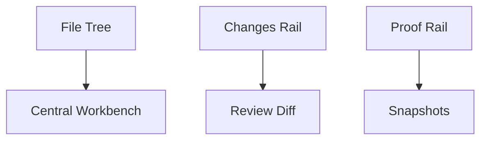
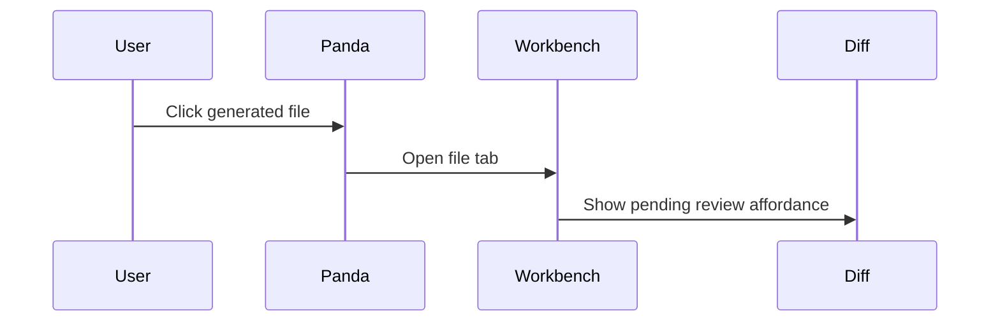

# Panda Plan Document Format

> Status: current guide  
> Last updated: 2026-05-22  
> Scope: generated Plan Mode documents, workbench plan tabs, and future real `.panda/plans/*.plan.md` files

Panda plan documents use a Cursor-style `.plan.md` shape: YAML frontmatter for metadata and task state, followed by clean Markdown for the human-readable plan body.

The goal is to keep generated plans readable in the workbench without showing users a noisy wall of nested headings.

## File Naming

Synthetic plan tabs currently use `plan:<sessionId>` internally. Future persisted plan files should use:

```txt
.panda/plans/<task-slug>.plan.md
```

Use `.plan.md` instead of plain `.md` when the document should retain registered plan behavior such as Review, Edit, Save Draft, Approve, and Build.

## Frontmatter

Plan metadata belongs in frontmatter, not visible body headings.

```yaml
---
name: "Workbench-Owned File Opening"
overview: "Make the central workbench own file opening and generated-change review."
status: "ready_for_review"
sessionId: "planning_session_123"
todos:
  - id: "summary"
    content: "Summary"
    status: "pending"
  - id: "implementation-plan"
    content: "Implementation Plan"
    status: "pending"
isProject: false
---
```

Supported todo statuses:

- `pending`
- `in-progress`
- `completed`
- `error`

The workbench plan renderer parses this metadata and displays it as a compact task/metadata card. It should not be shown as raw YAML in Review mode.

## Body Structure

Prefer this structure for generated implementation plans:

````md
# <Plan Title>

## Summary

One concise explanation of the outcome, scope, and approach.

## Architecture


## Implementation Plan

| Step | Area | Planned direction |
|---:|---|---|
| 1 | Layout | Move file work into the central workbench. |
| 2 | Changes | Keep the right rail as navigation/status only. |

## Files

| File / System | Expected change |
|---|---|
| `ProjectWorkspaceLayout.tsx` | Workbench is the primary surface. |
| `RightPanel.tsx` | Support rail only. |

## Validation

- [ ] Run TypeScript.
- [ ] Run targeted tests.
- [ ] Confirm generated files do not auto-open.

## Risks

| Risk | Mitigation |
|---|---|
| Scope drift | Keep work tied to the approved plan. |

## Open Questions

Only include this section when unresolved decisions remain.
````

## Mermaid

Use Mermaid for architecture, workflow, dependency, sequence, or state diagrams. Keep diagrams focused and small enough to scan.

Common examples:

````md

````

````md

````

The plan renderer renders fenced `mermaid` blocks visually and falls back to the raw code block if rendering fails.

## Style Rules

- Use at most `#`, `##`, and occasional `###` headings.
- Do not use hashtags as visual decoration.
- Prefer tables for task/file/risk/status information.
- Prefer checkboxes for validation criteria.
- Keep code snippets short. Plan Mode should not paste full implementations.
- Put metadata in frontmatter, not body headings.
- Keep normal generated documentation as `.md`; use `.plan.md` for registered plan documents.

## Current Implementation

Implemented pieces:

- Frontmatter serialization for generated plan artifacts.
- Existing Markdown receives frontmatter if it does not already have it.
- Existing frontmatter is preserved.
- Workbench plan tab renders frontmatter as metadata/task UI.
- Workbench plan tab renders Mermaid diagrams.
- Plan Mode prompt asks for shallow headings, Mermaid, tables, and checklists.
- Convex structured intake plans generate Summary, Architecture, Implementation Plan, Files, Risks, and Validation sections.

Follow-up:

- Persist registered plan documents as real `.panda/plans/*.plan.md` files while preserving plan artifact metadata and Build/Approve behavior.
